# Covid19 Info

App to monitor statistics and news about Covid19 especially in Nepal.

## Built With

- [Flutter](https://flutter.dev)

## Features

- Global status of infection on an interactive map with search functionality.
- Global statistics such as confirmed, deaths and recovered.
- Interactive graph of global spread over time.
- Statistics (Confirmed, active, recovered, critical, deaths etc.) of each country.
- Interactive timeline graph of each country.
- Infected districts of Nepal on an interactive map with search functionality.
- Number of confirmed cases on each district with details.
- PCR tests, RDT tests, Positive, Negative, Quarantined, Isolation, Recovered, Active and Deaths status of Nepal.
- Interactive timeline graph of Nepal.
- Latest news from Nepal.
- Hospital details in Nepal.
- List of FAQ about the coronavirus.
- List of myths and facts about the coronavirus.
- List of podcasts providing information about the virus.
- Fully featured podcast player.

## API Used

- [Nepal Corona Info](https://www.nepalcorona.info/data/api)
- [Covid19 API](https://covidapi.info)
- [CoronaTracker](https://api.coronatracker.com)

## Screenshots

 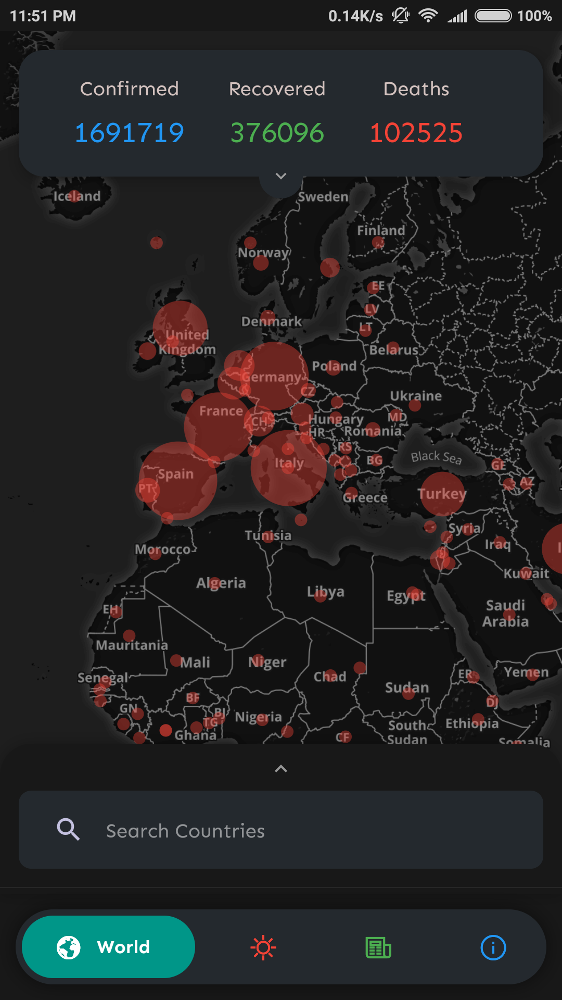 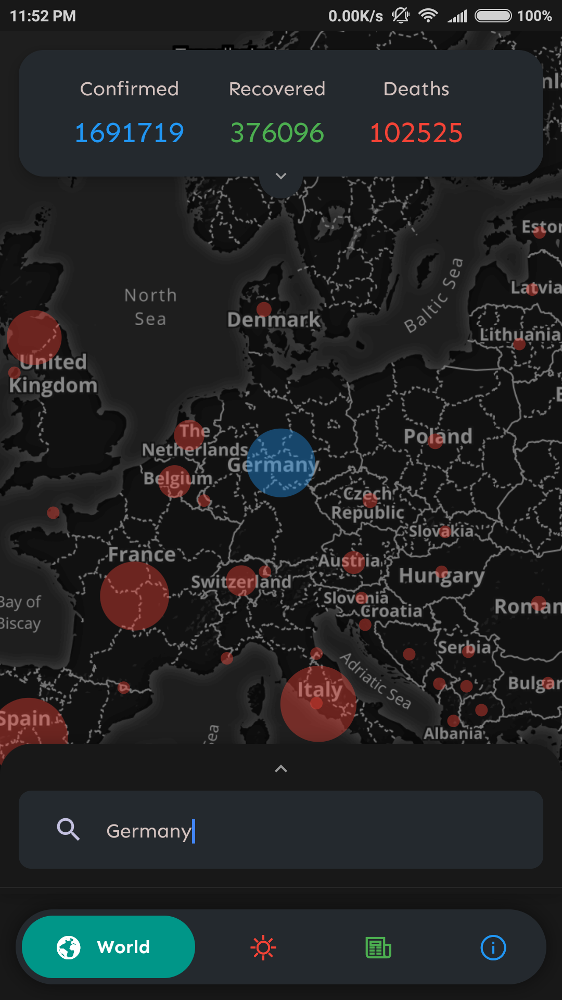 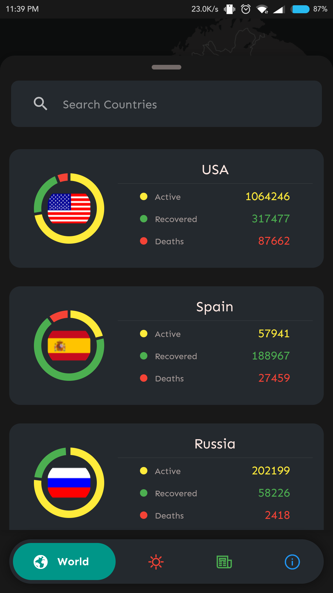 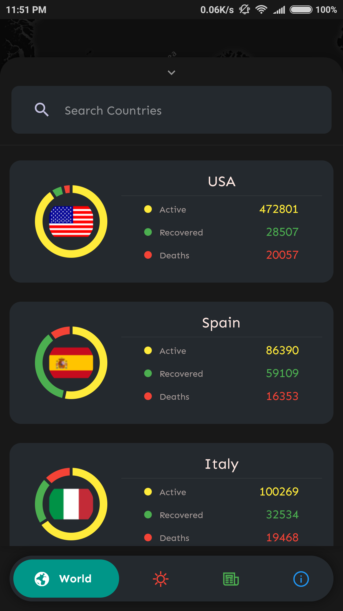 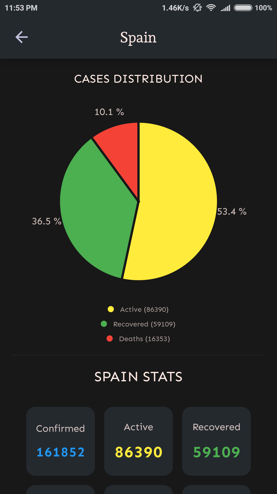 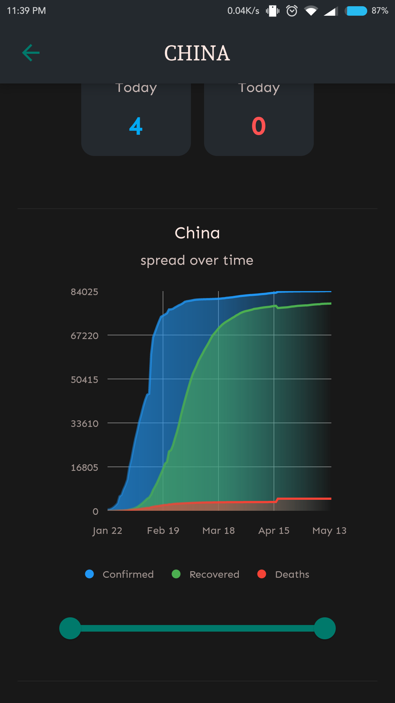 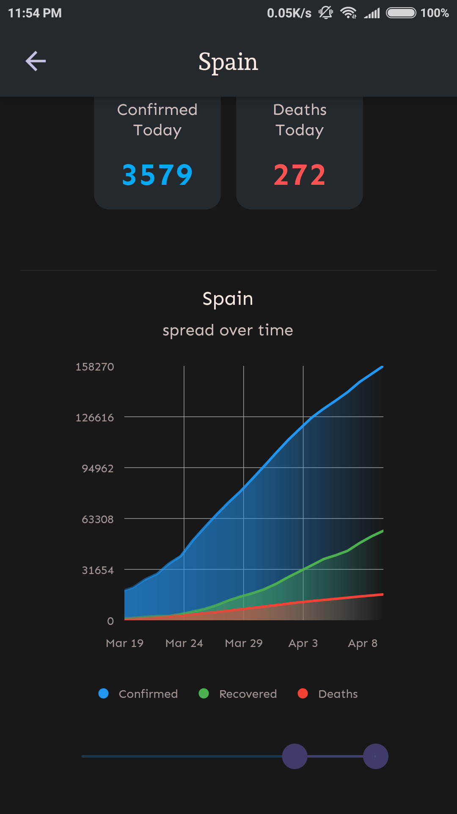 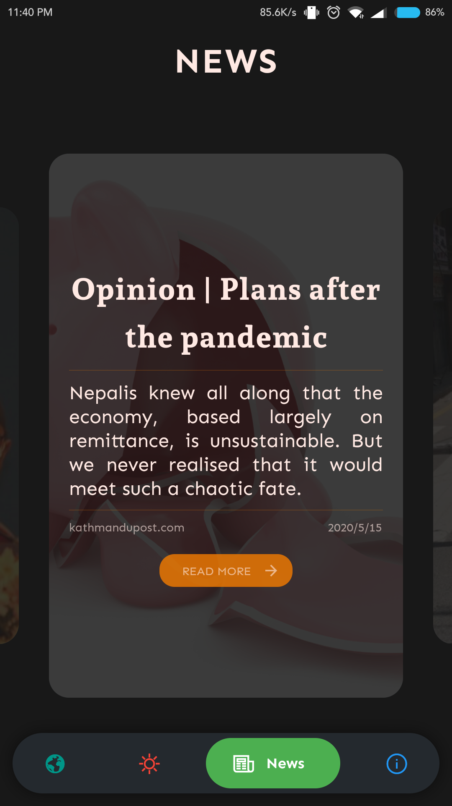  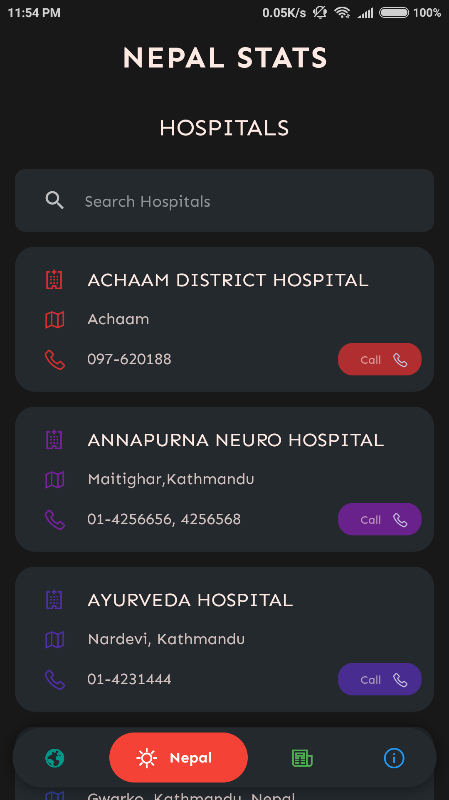  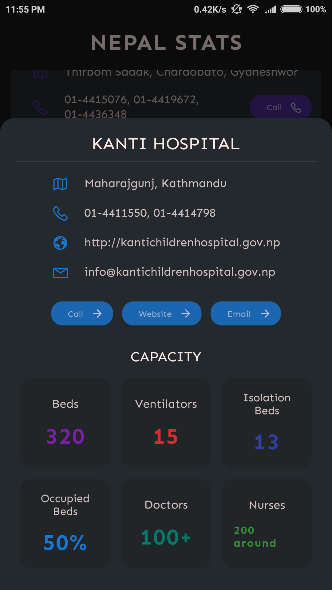  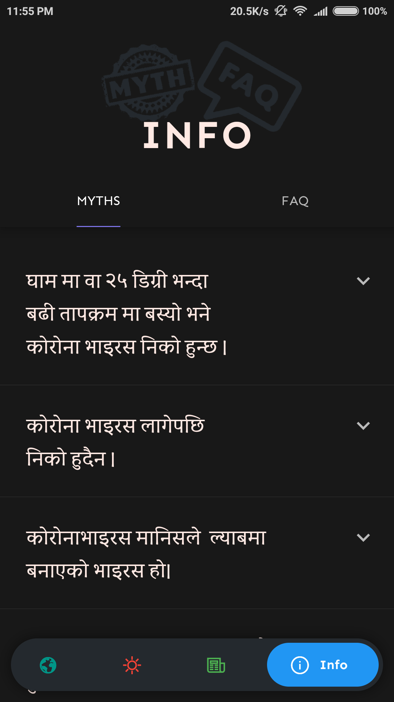 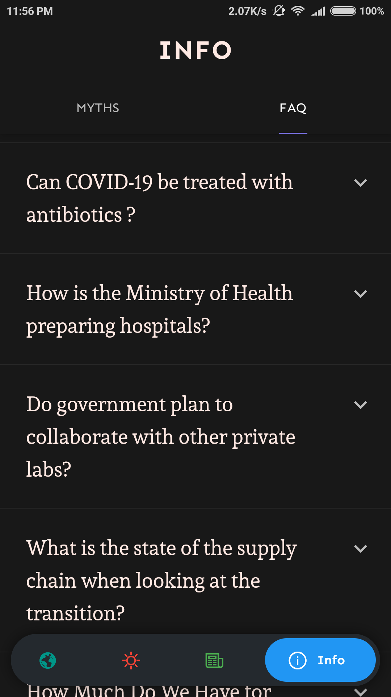  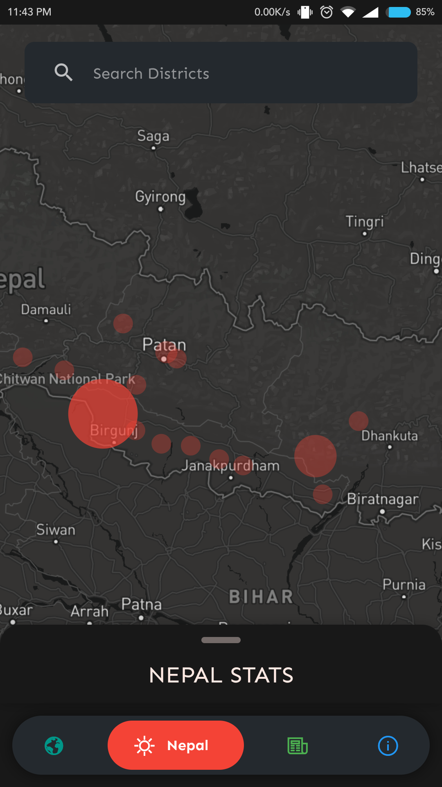 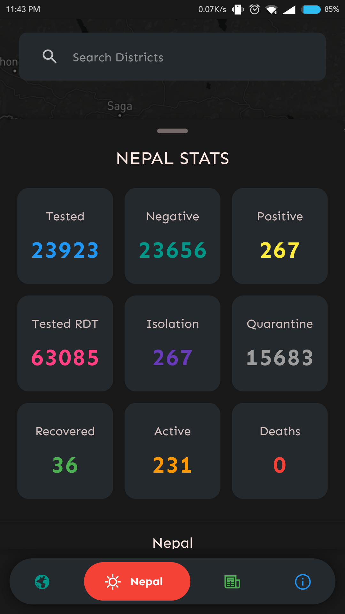 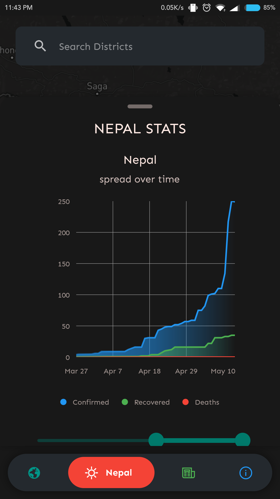 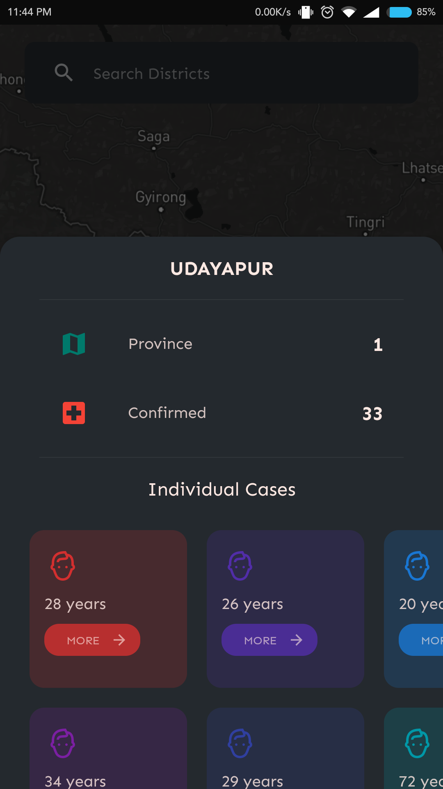 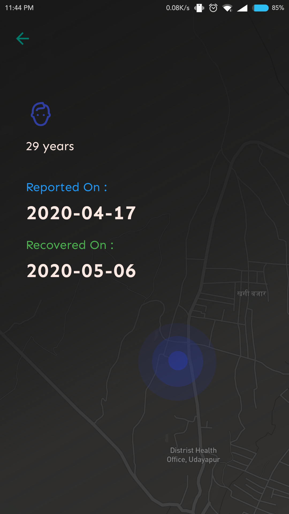
